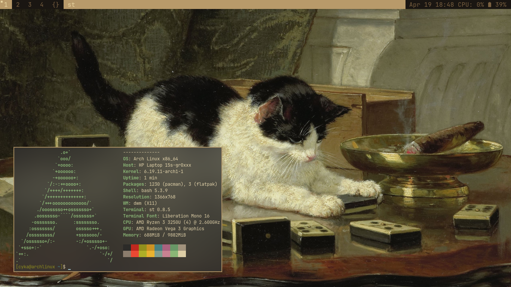
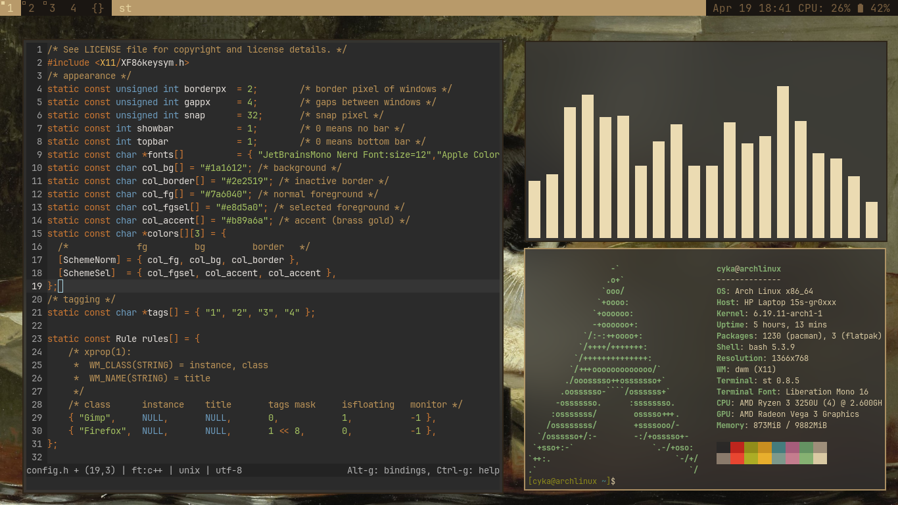

# a very minimalist dwm + st + slstatus + picom setup

## Wallpaper

## Patches
- **dwm**:
  - none

- **st**:
  - alpha 
## Installation
1. git clone https://github.com/aurhmnshu/dwm-config.git
2. cd dwm-config/dwm
3. sudo make clean install
4. cd ../slstatus
5. sudo make clean install 
6. cd ../st
7. sudo make clean install
